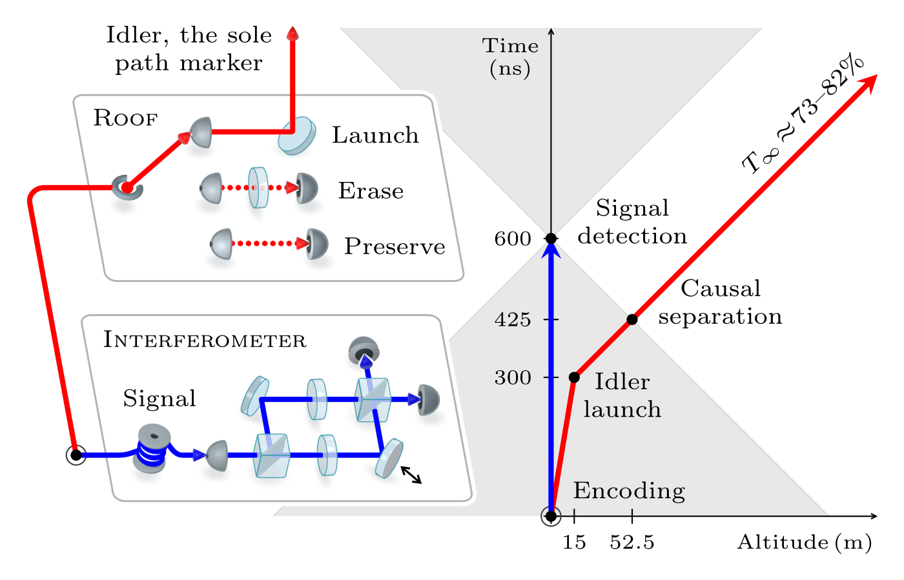

# Code and Data for Complementarity Test with Unmeasured, Permanently Inaccessible Path Markers

Paul Gauthier, Sahil Patel, Sean Doan, and Galan Moody.

This repository contains the immutable experimental and archived
environmental inputs, executable analysis code, and reviewed reference
products for the complementarity test described below.

## Abstract

<!-- article-abstract-begin -->
In prior complementarity tests, path markers were measured and remained causally accessible, leaving the collapse-locality loophole open. We address this loophole using a quantum eraser that isolates the encoding of path information in the joint quantum state from its later measurement and causal accessibility. We launch idler photons—the sole path markers for entangled signal photons in an interferometer—on outgoing null trajectories while the joint state remains in a coherent superposition of both interferometer path alternatives. Our flat ΛCDM transmission model predicts that 73–82% of launched idlers will propagate forever without absorption, scattering, or environmental path-record formation. For these modeled survivors, each path marker remains perpetually unmeasured, and propagation along its outgoing trajectory precludes later causal contact with its interferometric record. Unconditioned signal detections show no statistically significant launch-induced change in interference, as standard quantum theory predicts. Normalized to the modeled survivors, the 95% confidence upper bound on any launch-induced fringe is 0.16 of full restoration.
<!-- article-abstract-end -->

<p align="center">
  
</p>

## Quick start

All commands run from the repository root.

```sh
./container/build.sh
./container/run.sh
./container/run.sh python -m unittest discover -v
./container/run.sh python -m scripts.verify_results
```

For an existing compatible Python environment, run `./scripts/reproduce.sh`
directly. Reproduction is offline: it validates `data/checksums.sha256`, reads
only configured inputs, recreates ignored `build/`, and never modifies
`data/raw/`, `results/`.

`python -m scripts.verify_results` compares the local build with reviewed results.
Updating reviewed products is deliberately separate:

```sh
python -m scripts.promote_results
```

Promotion first checks build-internal invariants and copies only the canonical
paths declared by `config/artifact.json`.

## Layout

- [analysis/](analysis/) — executable analysis and reporting modules
- [config/artifact.json](config/artifact.json) — dataset roles and configured transmission inputs
- [data/raw/](data/raw/) — immutable acquisition and archived source inputs
- `build/` — ignored local reproduction
- [results/](results/) — reviewed figures, tables, and analysis, with cross-dataset and per-dataset guides
- [scripts/](scripts/) — reproduction, verification, and promotion entry points
- [container/](container/) — versioned reference environment
- [assets/](assets/) — stable presentation assets
- [tests/](tests/) — validation tests

See [DATA_DICTIONARY.md](DATA_DICTIONARY.md) for input data details,
[LICENSE.md](LICENSE.md) for licensing, and
[DATA_PROVENANCE.md](DATA_PROVENANCE.md) for source and attribution details.
Preferred citation metadata is provided in [CITATION.cff](CITATION.cff).
