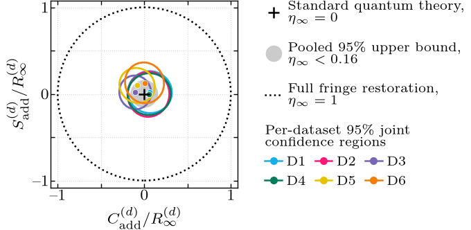
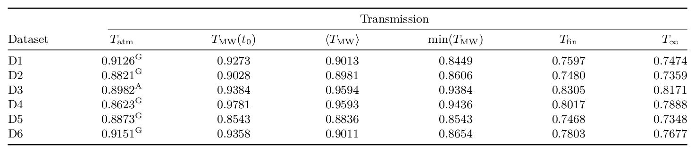
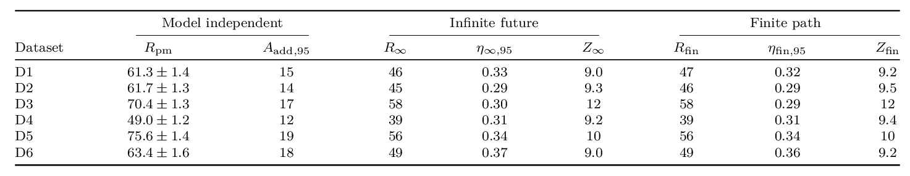

# Reviewed dataset products

This directory contains the reviewed reference reproduction. Analysis commands
write to ignored `build/`; only `scripts/promote_results.py` updates this tree.

Products are grouped under
`datasets/<timestamp>--<timestamp>/`.
Each complete dataset contains machine-readable analysis, figures, tables,
environmental reports, and manuscript macros.

## Cross-dataset summary

The pooled analysis is available as
[`analysis/mzi-pooled-analysis.json`](analysis/mzi-pooled-analysis.json).
The intergalactic-transmission budget is available as
[`analysis/igm-transmission.json`](analysis/igm-transmission.json).

The captionless TeX fragments are
[`tables/dataset-transmission.tex`](tables/dataset-transmission.tex)
and [`tables/dataset-analysis.tex`](tables/dataset-analysis.tex).

## Datasets

- **D1**: [`2026-03-05-13-29-15--2026-03-05-14-20-45`](datasets/2026-03-05-13-29-15--2026-03-05-14-20-45/) — launch `2026-03-05-13-29-15`, preserve `2026-03-05-14-20-45`
- **D2**: [`2026-03-06-15-06-58--2026-03-06-16-03-22`](datasets/2026-03-06-15-06-58--2026-03-06-16-03-22/) — launch `2026-03-06-15-06-58`, preserve `2026-03-06-16-03-22`
- **D3**: [`2026-03-06-21-27-03--2026-03-06-22-25-50`](datasets/2026-03-06-21-27-03--2026-03-06-22-25-50/) — launch `2026-03-06-21-27-03`, preserve `2026-03-06-22-25-50`
- **D4**: [`2026-03-08-06-52-49--2026-03-08-07-59-00`](datasets/2026-03-08-06-52-49--2026-03-08-07-59-00/) — launch `2026-03-08-06-52-49`, preserve `2026-03-08-07-59-00`
- **D5**: [`2026-03-08-12-21-56--2026-03-08-13-28-33`](datasets/2026-03-08-12-21-56--2026-03-08-13-28-33/) — launch `2026-03-08-12-21-56`, preserve `2026-03-08-13-28-33`
- **D6**: [`2026-03-08-14-44-08--2026-03-08-15-45-35`](datasets/2026-03-08-14-44-08--2026-03-08-15-45-35/) — launch `2026-03-08-15-45-35`, preserve `2026-03-08-14-44-08`

The semantic launch and preserve roles are declared `config/artifact.json`.
