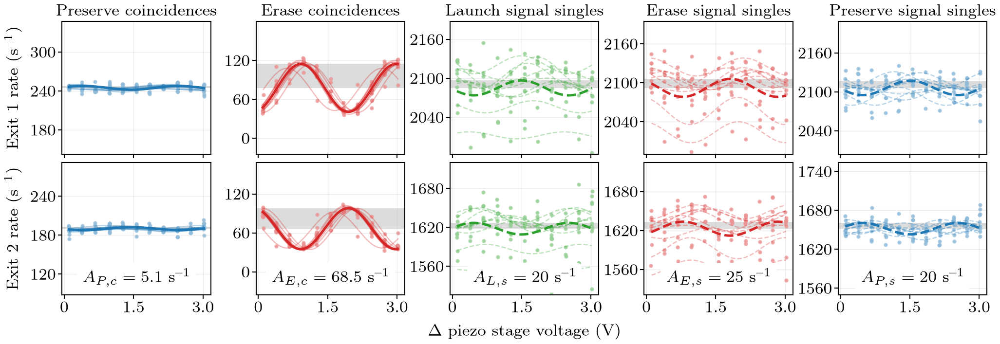
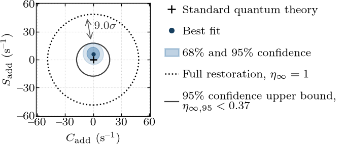
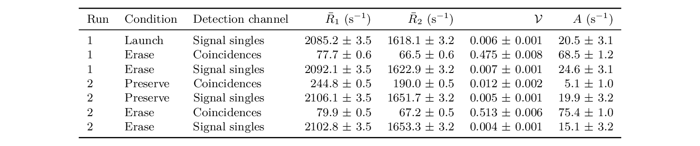
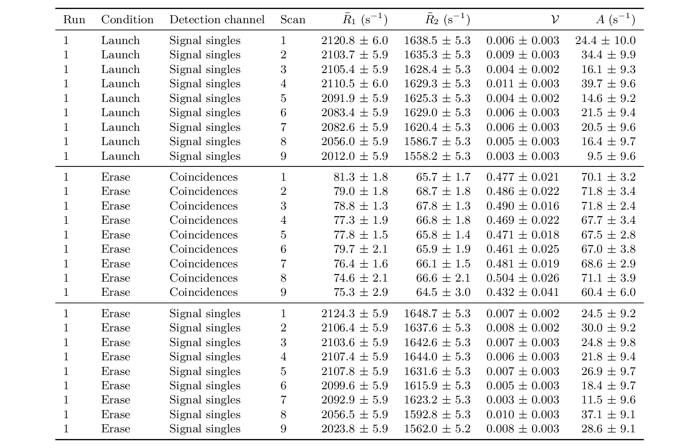
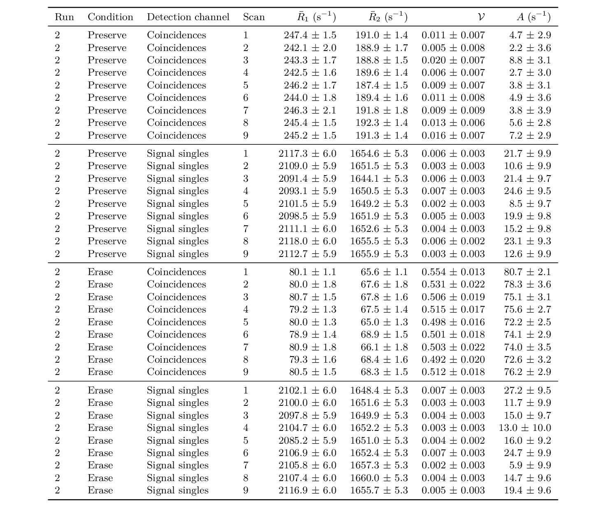

# Dataset D6 reviewed reference products

Dataset: `2026-03-08-14-44-08--2026-03-08-15-45-35`

- Launch run: `2026-03-08-15-45-35`
- Preserve run: `2026-03-08-14-44-08`
- Visual conditions: Perfect clear blue sky before launch, 3:33 PM

## Figures

## Tables

Machine-readable analysis is under `analysis/`, environmental reports under
`conditions/`, and generated manuscript macros under `manuscript-values/`.
